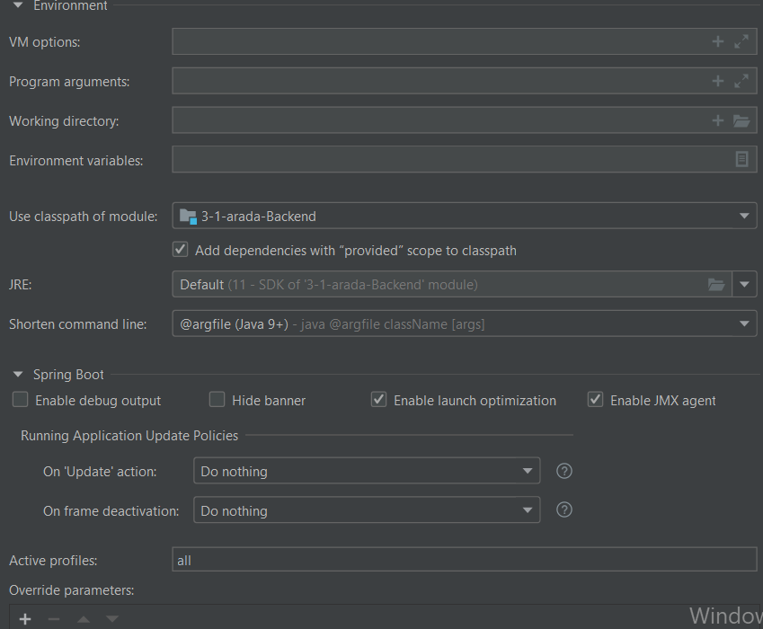

Bitirme Projesi Backend Reposu

* KURULUM
  * JAVA_HOME'un ortam değişkenlerinde olması gereklidir. Command'lerden java -version denendiğinde bir java versiyonu gelmelidir
  * Maven yüklü olmalıdır. Versiyon olarak maven 3.8.4 kullanılmıştır. 
  Maven yükelmek için https://dlcdn.apache.org/maven/maven-3/3.8.4/binaries/apache-maven-3.8.4-bin.tar.gz dosyası indirilip istenen klasöre konulmalıdır. Ortam değişkenlerine eklemek için M2_HOME değişken adı ile maven klasörünün sodya yolu girilmelidir. 
  Son adım olarak path değişkenine maven2i ekleyebilmek için %M2_HOME%\bin eklenmelidir. Maven yüklemesinin başarılı olup olmadıı mvn -version komutuyla kontrol edilebilir.
  * Maven kurulumu tamamlandıktan sonra ide'den (intellij idea) versiyon kontrol üzerinden yeni proje seçeneği seçilir. Backend reposunun linki olan https://github.com/beyzaydin/3-1-arada-Backend.git ekrana girilir. git credential'leri girilerek proje locale alınır.
  * Proje indexlenirken file->project kısmından projede kullanılacak olan sdk (11.0) seçilir. Bu adımlardan sonra maven ve dependecyler indirildiğinden bu kısım uzun sürebilir. 
  *  SS'te görüldüğü üzere konfigürasyon oluşmalıdır. Oluşan konfigürasyonda seçenekler aşağıdaki ss gibi olmalıdır. Main class ise otomatik gelmelidir.
  
  Bu aşamalar başarılı gerçekleştirildikten sonra proje sorunsuz çalışacaktır. 